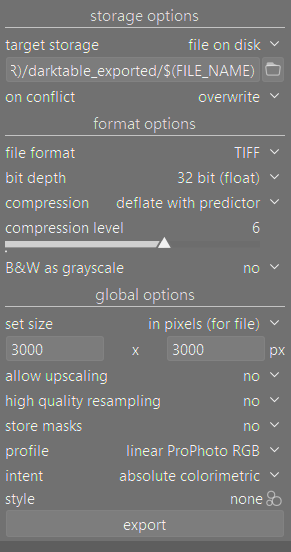

# `agx-emulsion`: simulation of color film photography from scratch

> [!IMPORTANT]
> At this stage, this project is very experimental and a work in progress. Things might change fast, and it is really just a playground for exploring the simulation model.

## Introduction

In this project we will experiment with the simulation of color film photography processes. The simulation emulates a negative emulsion starting from published data for film stocks. An example of curves for Kodak Portra 400 (data-sheet e4050, 2016) is in the following figure (note that CMY diffuse densities are generic ones, because they are usually not published).


An example of data from print paper Kodak Portra Endura (data-sheet e4021, 2009) is in the next figure.


The left panel shows the spectral log sensitives of each color layer. The central panel shows the log-exposure-density characteristic curves for each layer when a neutral grey gradient illuminated with a reference light is used to expose the medium. The panel on the right shows the absorption spectra of the dyes formed on the medium upon chemical development. 'Min' and 'Mid' are the absorption for the unexposed processed medium and a neutral grey "middle" exposure medium, respectively.

Starting from linear RGB data from a RAW file of a camera, the simulation recreates the spectral data, then we project the virtual light transmitted from the negative to print paper, and it uses a simplified color enlarger with dichroic filters for balancing the colors of the print. Finally we scan the virtual print using the light reflected from the print.

The pipeline is sketched in this figure adapted from [^1]:

where the light from a scene (raw file from your camera) is exposed on a virtual negative with specific spectral sensitivities, then a chemical process create the dye densities (using density curves and more complex interactions modeling the couplers). The virtual negative is projected with a specific illuminant on paper that is developed again (simple density curves, no coupler in this case, print paper is already design to reduce cross-talk of channel since doesn't have to sample a scene but just the dyes on the negative).

The pipeline allow to add many characteristic in a physically sound way. For example:

- halation
- film grain generated on the negative (using a stochastic model)
- pre-flashing of the print to retain highlights

From my experience playing around with film simulation, data-sheet curves are really not enough to reproduce a decent film look. The key is to understand that in the film emulsion there are couplers (chemicals that are produced in the development along side the actual CMY dyes) that are very important to achieve the desired saturation. Mainly there are:

- masking couplers, that gives the typical color orange to the unexposed developed film. This couplers are consumed locally if density is formed and are used to reduce the effect of cross-talk of the absorption of the layers, thus increasing saturation.
The presence of masking couplers is simulated with negative absorption contribution in the isolated dye absorption spectra. See for example the data of Portra 400 updated to include the masking couplers and with unmixed print density characteristic curves:


- direct inhibitor couplers, that are released locally when density is formed and inhibit the formation of density in nearby layers or in the same layer. This increases saturation and contrast. Also if we let the coupler diffuse in space they can increase local contrast and perceived sharpness. The simulation of coupler inhibitors is inspired by [Michaelis–Menten inhibition kinetics](https://en.wikipedia.org/wiki/Michaelis%E2%80%93Menten_kinetics).

A more detailed description of colour couplers can be found in Chapter 15 of Hunt's book [^2].

## Installation

### Using `uv`

You can easily run the latest version of agx-emulsion directly from the git repository
using [uv](https://docs.astral.sh/uv/):

```bash
uvx --from git+https://github.com/andreavolpato/agx-emulsion.git agx-emulsion
```

Or from a local working copy:
```bash
uvx path/to/local/working_copy
```

#### Installing uv

Under Windows you can install `uv` using the following command, which you only need to exeucte the first time:
```bash
# ! you only need to exeucte this command the first time to install uv!
powershell -ExecutionPolicy ByPass -c "irm https://astral.sh/uv/install.ps1 | iex"
```
Intructions for macOS and Linus are [here](https://docs.astral.sh/uv/getting-started/installation/#standalone-installer).


### Using `pip`

You can also use pip normally:
```bash
# install:
git clone https://github.com/andreavolpato/agx-emulsion.git
cd agx-emulsion
pip install -e .

# run
agx-emulsion
```
but I recomend to create a clean virtual environment to install the dependencies, for example using `conda`.

#### Using `conda`
From a terminal:

```bash
conda create -n agx-emulsion python=3.11
conda activate agx-emulsion
```

Install the package `agx-emulsion` by going to the repository folder and running:

```bash
pip install -e .
```
Launch the GUI:

```bash
agx-emulsion
```
To remove the environment:
```bash
conda env remove -n agx-emulsion
```

## GUI
When launching the GUI, `napari` window should appear. In `napari` I usually set the theme to `Light` because I find it easier to judge exposure with a white background. Go to `File >> Preferences >> Appearance >> Theme >> Light`. Note that `napari` is not color-managed. The way I am working is to set the color profile of screen and operating system to an sRGB profile, and I set the output color space of the simulation to sRGB.

It is recommended to use a 1080p or higher resolution screen to fit all the controls. The GUI is based on `magicgui` that integrates very well with `napari` and allows for minimal code to reach an usable state.

You should load an image that you converted from a raw file and kept linear, I usually save in 16-bit or 32-bit float to preserve the dynamic range. The spectral upsampling algorithm works on the full visible locus, so it is recommended to save the images in a large color space, such as linear Rec2020 or linear ProPhoto RBG, to preserve all the saturation goodness. Play with the parameters and press `Run` to run the simulation.

> [!IMPORTANT]
> In order to correctly load a 16-bit/32-bit image file there is a small widget called `filepicker` that will import the image as a new layer using OpenImageIo. For example images saved as PNG, TIFF, or EXR work, but other formats might too.

> [!TIP]
> Hover with the mouse on the widgets and controls to visualize an help tooltip.


Please bear in mind that this is a highly experimental project and many controls are left exposed in the GUI with poor or no documentation. Make use of the help tooltips by hovering the control boxes or explore the code.
Play with `exposure_compensation_ev` to change the exposure of the negative. You can visualize a virtual scan of the negative by pressing `compute_negative` and `Run`.

For fine tuning of halation play with `scattering size`, `scattering strength`, `halation size`, `halation strength`. There are three controls for each that define the effect on the three color channels (RGB). `scattering size` and `halation size` represent the value of sigma for Gaussian blurring. `scattering strength` and `halation strength` refers to the percentage of scattered of halation light.
`y filter shift` and `m filter shift` are the control for the virtual yellow and magenta filters of the color enlarger. They are the number of steps for the shift from a neutral position, i.e. starting settings that make an 18% gray target photographed with correct reference illuminant fully neutral in the final print. The enlarger has 170 steps.

There are controls to apply lens blur in several stages of the pipeline. For example in the camera lens, in the color enlarger lens or the scanner. There is also a control for blurring the density as an effect of diffusion during development `grain > blur`. The scanner has also sharpness controls via a simple unsharp mask filter.

For example by magnifying the film, like a 0.7x0.7 mm sized crop, reveals the isolated dye clouds.


This is one of the most appealing aspect for me, when I think of printing posters of high resolution simulated images retaining all this low level grain detail not available in the original picture.

## Preparing input images with darktable

The simulation expects linear scene-referred files as input (with or without  a transfer function).
I usually open RAW files of digital cameras with [darktable](https://www.darktable.org/) and deactivate the non linear mappings done by `filmic` or `sigmoid` modules and adjust the exposure to fit all the information avoiding clipping. Then I export the file as a 32-bit (float) TIFF in linear ProPhoto RGB, e.g. with the following export settings:



## Example usage of the GUI

[](https://github.com/user-attachments/assets/5f16aba6-3f59-41a2-a9d1-6ffa4d1c939c)

Thank you Adam Severeid from [discuss.pixls.us](https://discuss.pixls.us/) forum [Have a seat, we’ve been waiting for you. - discuss.pixls.us](https://discuss.pixls.us/t/have-a-seat-weve-been-waiting-for-you/44814) for providing the RAW in a Play Raw post that I used here.

## Things to consider

- The simulation is quite slow for full resolutions pictures. On my laptop it takes roughly 10 seconds to process 6MP images (it got much more efficient than v0.1.0). I usually adjust most of the values with scaled down preview images, that is by default computed in the GUI, then when a final image is need I activate the `compute full image` checkbox that bypasses the image scaling.
- Fujifilm profiles are for now less trustworthy than Kodak ones because the data taken from a single data-sheet are not self-consistent, i.e. they do not work very well after the unmixing step. To make them work ok-ish, a small adjustment is performed to obtain neutral grayscales, this might change in the future.

## References

[^1]: Giorgianni, Madden, Digital Color Management, 2nd edition, 2008 Wiley
[^2]: Hung, The Reproduction of Color, 6th edition, 2004 Wiley
[^3]: Mallett, Yuksel, Spectral Primary Decomposition for Rendering with sRGB Reflectance, Eurographics Symposium on Rendering - DL-only and Industry Track, 2019, doi:10.2312/SR.20191216

Sample images from [signatureedits.com](https://www.signatureedits.com/)/free-raw-photos.
